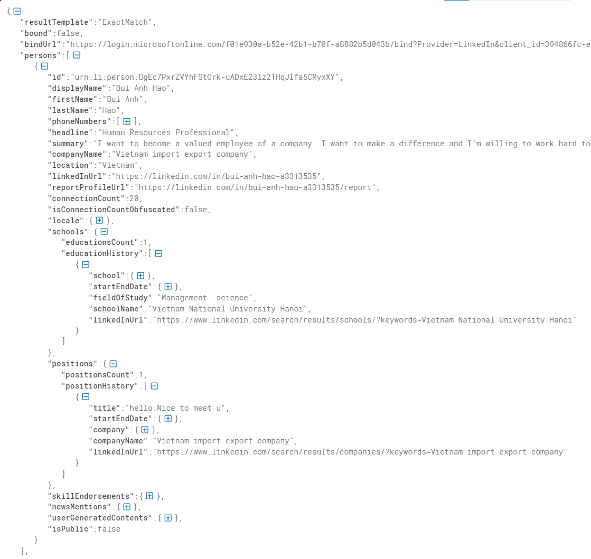

# Map LinkedIn Email

## Demo

### Email No Match with LinkedIn


### Email Match with LinkedIn



---

## Overview

This project builds a privacy-aware workflow to enrich email-based customer records with LinkedIn profile information. Given a list of emails, the pipeline checks whether each email can be matched to a LinkedIn account and summarizes the available professional information for analytics.

The project focuses on profile enrichment, coverage measurement, and data-quality analysis.

---

## Objective

Customer datasets often contain emails but lack professional context. This project helps answer:

- Which emails can be matched to LinkedIn profiles?
- What professional, education, and work-experience information is available?
- How complete is the collected profile data?
- Can the enriched information support customer segmentation and analytics?

---

## Input

The project uses an email sample as the lookup key.

| Input | Count |
|---|---:|
| Email records | 50,000 |


---

## Information Extracted

The enriched data is grouped into three categories:

### General Profile

- Name or display name
- Headline
- Summary
- Current company
- Location
- LinkedIn URL
- Connection count
- Skills, when available

### Work Experience

- Job title
- Company
- Start year
- End year
- Number of experiences per profile

### Education

- School
- Degree
- Field of study
- Start year
- End year
- Number of education records per profile

---

## Approach

```text
Email sample
    |
    v
Authorized profile lookup
    |
    v
Classify lookup result
    |
    v
Parse profile response
    |
    v
Normalize profile, work, and education data
    |
    v
Aggregate results and evaluate data quality
```

The pipeline classifies each lookup result into:

- Matched profile
- Partial match
- No match
- Failed lookup

Matched responses are parsed into structured profile, education, and work-experience tables.

---

## Repository Structure

```text
.
├── 1_get_token_from_outlook.py
├── 2_email_in_linkedin.py
├── requirements.txt
├── docs/
│   ├── no match.png
│   └── demo1.png
├── resource/
│   ├── account.txt        # Local only; do not commit real accounts
│   ├── email.xlsx         # Local only; use anonymized or approved input
│   └── chromedriver       # Local driver, if required
├── access_token.json      # Generated output; do not commit
├── email_match_linkedin.json  # Generated output; do not commit
└── README.md
```


---

## How to Run

### 1. Create Environment

```bash
python -m venv .venv
source .venv/bin/activate
pip install -r requirements.txt
```

On Windows:

```bash
python -m venv .venv
.venv\Scripts\activate
pip install -r requirements.txt
```

### 2. Prepare Input Files

Create the `resource/` folder if it does not exist:

```bash
mkdir -p resource
```

Prepare the email input file:

```text
resource/email.xlsx
```

The Excel file should contain at least one column:

| column | description |
|---|---|
| `email` | Email address to check |

Example schema:

```text
email
example_001@example.com
example_002@example.com
```

Prepare the account file only in your local environment:

```text
resource/account.txt
```

Expected local format:

```text
outlook_email|password|optional_recovery_email
```


### 3. Configure Local Browser Driver

If the token collection script uses Selenium, make sure Chrome and a compatible ChromeDriver are available.

Example:

```bash
chmod +x resource/chromedriver
```

If your environment uses a different ChromeDriver path, update the driver path in the script or configure it through environment variables.

### 4. Generate Authorized Session Data

Run:

```bash
python 1_get_token_from_outlook.py
```

Expected output:

```text
access_token.json
```


### 5. Run Email-to-LinkedIn Matching

Run:

```bash
python 2_email_in_linkedin.py
```

Expected output:

```text
email_match_linkedin.json
```


## Results

From 50,000 email records:

| Stage | Count | Rate |
|---|---:|---:|
| Emails checked | 50,000 | 100% |
| Emails matched to LinkedIn accounts | 4,070 | 8.1% |
| Profiles with work-experience data | 2,041 | 4.1% |
| Profiles with education data | 1,560 | 3.1% |

---

## Work Experience Insights

Most profiles with work-experience data had one listed experience.

| Number of Experiences | Profile Count |
|---:|---:|
| 1 | 1,306 |
| 2 | 205 |
| 3 | 161 |
| 4 | 114 |
| 5 | 101 |

Top latest job titles included:

- Student
- Manager
- Teacher
- Project Manager
- Engineer
- Software Engineer
- Accountant
- Director
- Developer
- Architect

Work start year was partially available, while work end year was often missing, likely because many profiles list current or incomplete positions.

---

## Education Insights

Most profiles with education data had one listed education record.

| Number of Education Records | Profile Count |
|---:|---:|
| 1 | 1,226 |
| 2 | 230 |
| 3 | 73 |
| 4 | 18 |
| 5 | 6 |

Top education fields included:

- Business Administration and Management
- Information Technology
- Computer Science
- Marketing
- Accounting
- Human Resources Management
- Accounting and Finance
- Mechanical Engineering
- Finance

Education start and end years were more complete than work-experience time fields.

---

## Key Findings

- The workflow matched **4,070 / 50,000 emails** to LinkedIn accounts.
- **2,041 profiles** included work-experience information.
- **1,560 profiles** included education information.
- Education data was generally more complete than work-experience data.
- The enriched attributes can support customer profiling, segmentation, and professional-background analysis when used with proper authorization and privacy controls.


---

## Portfolio Summary

Built an email-to-LinkedIn enrichment workflow that maps email records to professional profile attributes using authorized lookup. The pipeline parses and normalizes profile, work-experience, and education information, then evaluates enrichment coverage and data quality. On a 50,000-email sample, the workflow matched 4,070 LinkedIn accounts, including 2,041 profiles with work-experience data and 1,560 profiles with education data.
